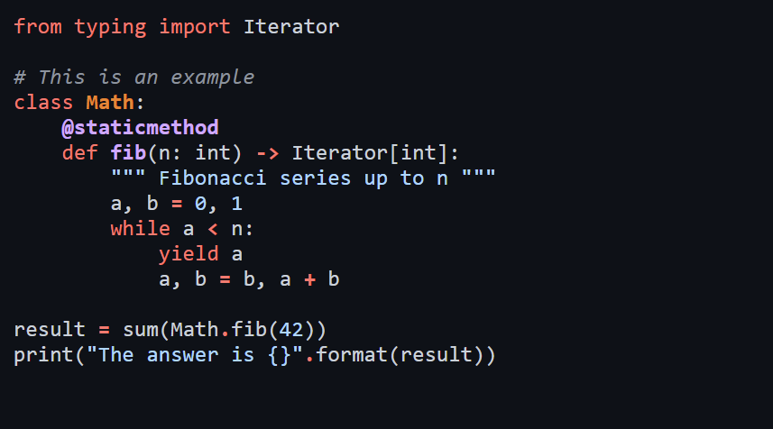

<pre align="center">
█▀▀ █ ▀█▀ █░█ █░█ █▄▄   █▀▄ ▄▀█ █▀█ █▄▀
█▄█ █ ░█░ █▀█ █▄█ █▄█   █▄▀ █▀█ █▀▄ █░█
</pre>

🌙 A simple Chroma theme based on GitHub's Dark color scheme!

No more client-side JS-based highlighting for a better dark highlighting theme with Hugo!

Feel free to open a Issue/PR for improvements!



# Build 🏗️
- Run `npm run build` inside project's root directory.
- You could also run `npm update -S` before running the build to use the latest GH styles.
- Look for `dist/gh-dark-chroma.css` after successful build.

# Use with Hugo 🛠️
- Head over to the [Releases](https://github.com/cryptic-code/github-dark-chroma-theme/releases) page, and download the lastest `gh-dark-chroma.css.zip`.
- Turn `markup.highlight.noClasses` to `false` in your Hugo config.
- Then simply include the downloaded stylesheet in your layouts, e.g. in a `head` partial to make it available on all pages.

# Use with chroma CLI ⌨️
- Specify the output format as `html` when invoking `chroma` with `chroma -f html`.
- Clear out the styles from the generated output, i.e. delete everything in between the opening and closing `<style>` tags.
- Then just copy and paste the contents of `dist/gh-dark-chroma.css` in the cleared space.

# CSS Reference 📙
To create a reference stylesheet of classes, run:
```
hugo gen chromastyles --style=monokai > sample.css
```

# Credits ⭐
- [Primer Team & Contributors](https://primer.style/)
- [JSS Project](https://github.com/cssinjs/jss)
